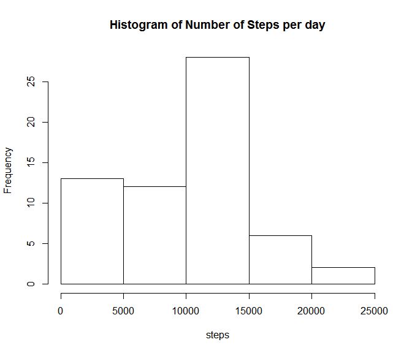
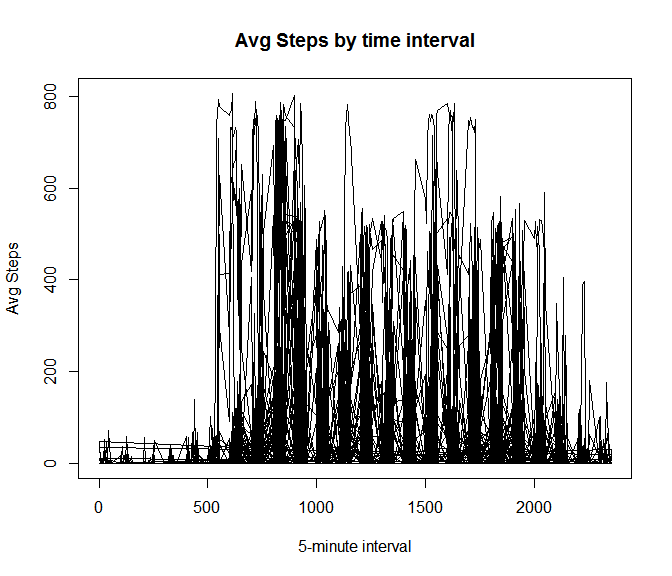
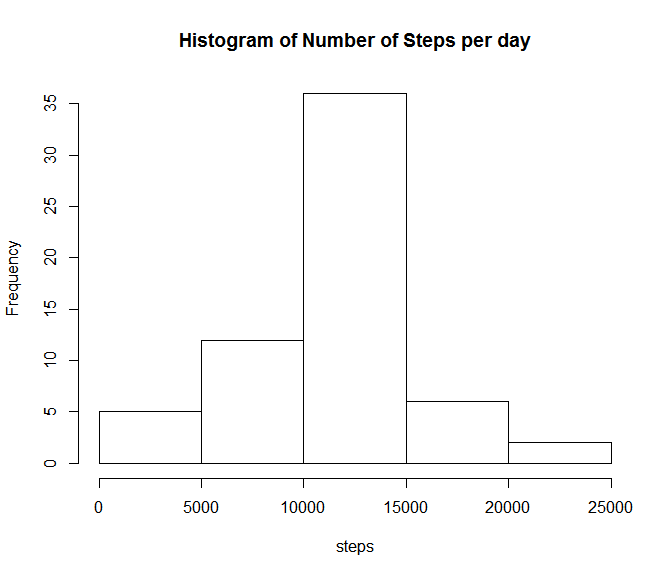
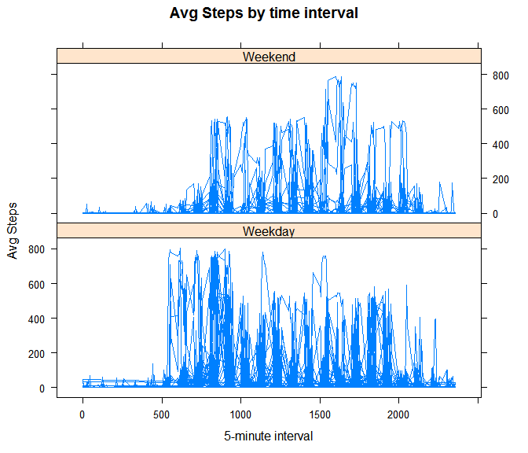

Reproducible Research: Course Project 1
========================================================

This assignment makes use of data from a personal activity monitoring device. This device collects data at 5 minute intervals through out the day. The data consists of two months of data from an anonymous individual collected during the months of October and November, 2012 and include the number of steps taken in 5 minute intervals each day.

Dataset is available from this [link](http://d396qusza40orc.cloudfront.net/repdata%2Fdata%2Factivity.zip)


## Loading and preprocessing the data

First steps for this assignment is to download, unzip and load the data.
For conveinience, data is then converted into a table.


```r
library(RCurl)
```

```
## Loading required package: bitops
```

```r
library(data.table)
#setwd("./pa1")
fileUrl <- "http://d396qusza40orc.cloudfront.net/repdata%2Fdata%2Factivity.zip"
download.file(fileUrl, destfile = "./data.zip")
unzip("data.zip")
data<-read.csv("activity.csv")
dt<-data.table(steps=data$steps,date=as.Date(data$date),interval=data$interval)
```


## What is mean total number of steps taken per day?

Create a Histogram of total number of steps taken each day:

_Note that we ignore NAs_


```r
#sum up steps per day into some tempdata
tmpd<-dt[, sum(steps,na.rm=TRUE), by="date"]
hist(tmpd$V1,main="Histogram of Number of Steps per day",xlab="steps")
```

 

Calculate the mean and median of total number of steps taken per day:

_again ignoring NAs_


```r
mean(tmpd$V1,na.rm=TRUE)
```

```
## [1] 9354.23
```

```r
median(tmpd$V1,na.rm=TRUE)
```

```
## [1] 10395
```


## What is the average daily activity pattern?

Make a time series plot (i.e. type = "l") of the 5-minute interval (x-axis) and the average number of steps taken, averaged across all days (y-axis)


```r
#sum up steps per day into some tempdata
tmpd<-dt[, mean(steps,na.rm=TRUE), by="date,interval"]
plot(tmpd$interval,tmpd$V1,type="l", main="Avg Steps by time interval",
     xlab="5-minute interval",
     ylab="Avg Steps")
```

 

Which 5-minute interval, on average across all the days in the dataset, contains the maximum number of steps?


```r
tmpd[which.max(tmpd$V1),interval]
```

```
## [1] 615
```

## Imputing missing values

Calculate and report the total number of missing values in the dataset (i.e. the total number of rows with NAs)


```r
table(is.na(data$steps))
```

```
## 
## FALSE  TRUE 
## 15264  2304
```

Devise a strategy for filling in all of the missing values in the dataset.

The below code simply replaces NAs with the mean value of steps for any given time interval.


```r
tmpd<-dt[, mean(steps,na.rm=TRUE), by="interval"]
for(i in 1:length(data$steps)){
  if(is.na(data$steps[i])){
    impval=data$interval[i]
    data$steps[i]=tmpd$V1[tmpd$interval==impval]
  }
}
#no more NAs
table(is.na(data$steps))
```

```
## 
## FALSE 
## 17568
```

```r
#retabilize the dataframe
dt<-data.table(steps=data$steps,date=as.Date(data$date),interval=data$interval)
```

Make a histogram of the total number of steps taken each day and Calculate and report the mean and median total number of steps taken per day. Do these values differ from the estimates from the first part of the assignment? What is the impact of imputing missing data on the estimates of the total daily number of steps?


```r
#avg up steps per day into some tempdata
tmpd<-dt[, sum(steps,na.rm=TRUE), by="date"]
hist(tmpd$V1,main="Histogram of Number of Steps per day",xlab="steps")
```

 


```r
mean(tmpd$V1,na.rm=TRUE)
```

```
## [1] 10766.19
```

```r
median(tmpd$V1,na.rm=TRUE)
```

```
## [1] 10766.19
```

These values differe significantly.  It appears that imputing missing values normalizes the distribution.


## Are there differences in activity patterns between weekdays and weekends?

Create a new factor variable in the dataset with two levels -- "weekday" and "weekend" indicating whether a given date is a weekday or weekend day.


```r
data$weekday<-factor(weekdays(as.Date(data$date))=="Saturday"|weekdays(as.Date(data$date))=="Sunday",labels=c("Weekday","Weekend"))
#retabilize
dt<-data.table(steps=data$steps,date=as.Date(data$date),interval=data$interval,weekday=data$weekday)
```

Make a panel plot containing a time series plot (i.e. type = "l") of the 5-minute interval (x-axis) and the average number of steps taken, averaged across all weekday days or weekend days (y-axis). 


```r
#avg up steps per day into some tempdata
library(lattice)
tmpd<-dt[, mean(steps,na.rm=TRUE), by="date,interval,weekday"]
xyplot(V1~interval|weekday,data=tmpd,type="l", main="Avg Steps by time interval",
     xlab="5-minute interval",
     ylab="Avg Steps",
     layout=c(1,2))
```

 

knit2html()


